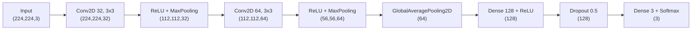
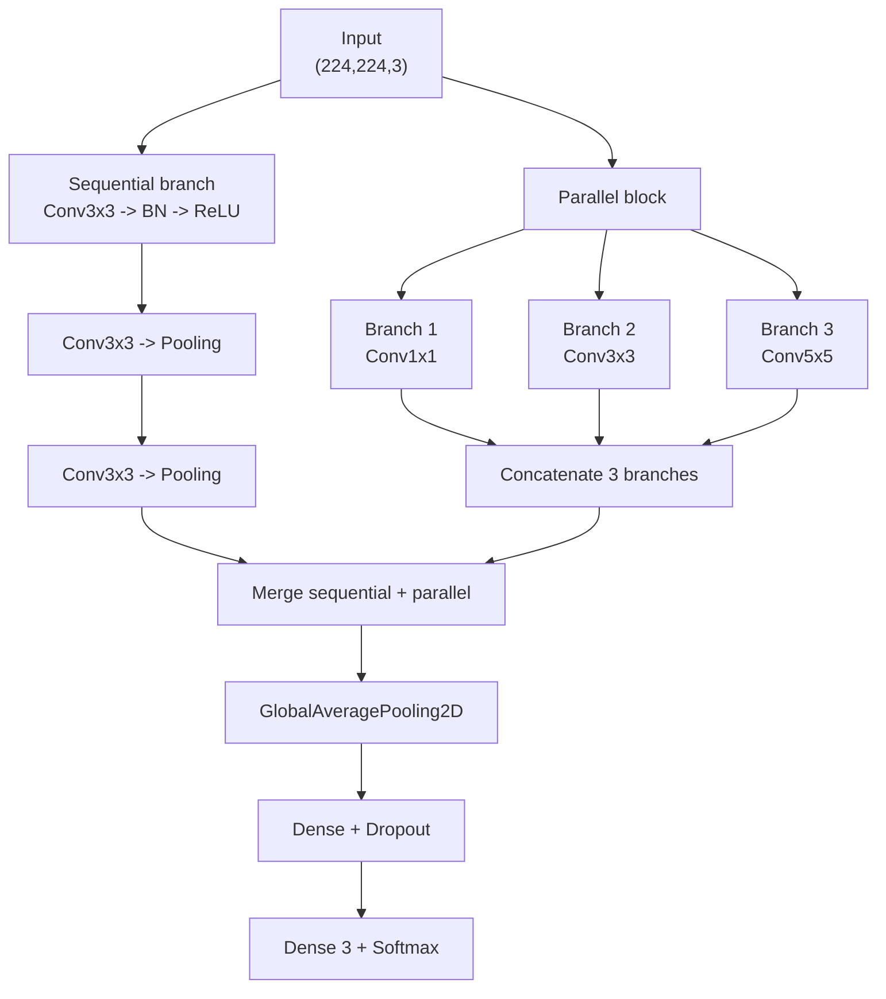
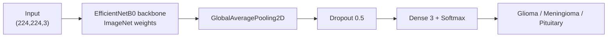

# Phân loại đa lớp u não từ ảnh MRI bằng ba kiến trúc Deep Learning trong 2 tuần

## 1. Bối cảnh nghiên cứu

U não là bệnh lý nguy hiểm, trong đó việc xác định đúng loại u có ý nghĩa quan trọng đối với chẩn đoán và điều trị. MRI là phương pháp hình ảnh phổ biến để quan sát não, nhưng các lớp `glioma`, `meningioma` và `pituitary tumor` có thể có đặc điểm hình thái tương tự nhau. Dự án xây dựng các mô hình Computer Vision để tự động phân loại ảnh MRI thành ba lớp trên.

CNN có khả năng tự học các đặc trưng từ ảnh, từ cạnh và texture ở các lớp đầu đến hình dạng và vùng tổn thương ở các lớp sâu. Dự án được triển khai theo đúng năm bước của đề bài: tiền xử lý dữ liệu, xây dựng CNN đơn giản, xây dựng CNN phức tạp, xây dựng mô hình transfer learning/fine-tuning và đánh giá so sánh.

## 2. Bài toán

Cho tập dữ liệu ảnh MRI và nhãn tương ứng:

$$
\mathcal{D}=\{(x_i,y_i)\}_{i=1}^{N}
$$

Trong đó $x_i$ là ảnh MRI và $y_i$ thuộc một trong ba lớp:

```text
0 -> glioma
1 -> meningioma
2 -> pituitary tumor
```

Mục tiêu là học hàm phân loại:

$$
f_\theta: \mathbb{R}^{H \times W \times 3} \rightarrow \{0,1,2\}
$$

sao cho nhãn dự đoán gần với nhãn thật và mô hình có khả năng tổng quát trên ảnh chưa từng xuất hiện trong training.

## 3. Dữ liệu và tiền xử lý

### 3.1. Dataset

Project sử dụng Figshare Brain Tumor Dataset:

| Thuộc tính | Thông tin |
|---|---|
| Số ảnh | 3.064 ảnh MRI |
| Số bệnh nhân | 233 |
| Số lớp | 3 |
| Lớp | Glioma, meningioma, pituitary tumor |
| Ảnh đầu vào | MRI T1-weighted contrast-enhanced |
| Dataset | [Figshare Brain Tumor Dataset](https://figshare.com/articles/dataset/brain_tumor_dataset/1512427) |

Phân chia dữ liệu cần được thực hiện trước augmentation. Chỉ tập training được augmentation; validation và test giữ nguyên để đánh giá công bằng.

### 3.2. Pipeline tiền xử lý (Bước 1)

Ảnh MRI gốc --> Kiểm tra và làm sạch --> Crop brain contour --> Chia train / validation / test --> Augmentation chỉ trên train --> Resize 224x224x3 --> Normalize --> Label encoding và one-hot encoding --> Đưa vào ba kiến trúc model

Các bước thực hiện:

1. **Làm sạch dữ liệu:** đọc ảnh hợp lệ, loại bỏ file hỏng/trùng lặp nếu có, kiểm tra nhãn, kích thước và số lượng ảnh ở từng class.
2. **Tách vùng cần thiết:** crop vùng não bằng threshold, erosion, dilation và contour lớn nhất; không sử dụng thông tin của validation/test để xây dựng quy tắc xử lý.
3. **Chia dữ liệu:** chia theo class thành train/validation/test với random seed cố định và giữ nguyên test set trước khi augmentation.
4. **Augmentation:** chỉ áp dụng cho tập train bằng các biến đổi hợp lý với ảnh MRI như rotation nhỏ, translation, zoom/shift và flip nếu phù hợp; không augmentation validation/test.
5. **Resize:** đưa toàn bộ ảnh về `224 x 224 x 3`. Ảnh grayscale được chuyển thành ba channel để tương thích với các mô hình.
6. **Normalize:** chuyển pixel về `float32` và chuẩn hóa về `[0,1]` hoặc dùng preprocessing tương ứng với EfficientNet; phải dùng cùng quy ước trong train, validation, test và inference.
7. **Mã hóa nhãn:** dùng mapping cố định `0=glioma`, `1=meningioma`, `2=pituitary tumor`, sau đó mã hóa one-hot khi dùng categorical cross-entropy.

Dữ liệu sau tiền xử lý có dạng:

```text
X: (batch_size, 224, 224, 3)
y: (batch_size, 3)
```

## 4. Thiết kế các mô hình (Bước 2, 3 và 4)

### 4.1. Bước 2 — Model 1: CNN đơn giản

Thiết kế một CNN đơn giản, huấn luyện từ đầu và không dùng pretrained weights. Model phải có đầy đủ convolutional layer, pooling layer và fully connected layer để làm baseline.



| Layer | Input | Output | Ý nghĩa |
|---|---|---|---|
| Conv2D 32 | `(224,224,3)` | `(224,224,32)` | Học đặc trưng cấp thấp |
| MaxPooling | `(224,224,32)` | `(112,112,32)` | Giảm kích thước không gian |
| Conv2D 64 | `(112,112,32)` | `(112,112,64)` | Học đặc trưng phức tạp hơn |
| MaxPooling | `(112,112,64)` | `(56,56,64)` | Giảm chi phí tính toán |
| GlobalAveragePooling | `(56,56,64)` | `(64)` | Tóm tắt mỗi feature map |
| Dense | `(64)` | `(128)` | Kết hợp các đặc trưng |
| Dense Softmax | `(128)` | `(3)` | Xác suất của ba class |

### 4.2. Bước 3 — Model 2: CNN phức tạp có tuần tự và song song

Thiết kế một CNN phức tạp bằng Functional API, sử dụng các CNN block và gồm hai kiểu xử lý:

- Nhánh tuần tự: các convolution nối tiếp để học đặc trưng theo nhiều cấp.
- Nhánh song song: nhiều convolution với kernel khác nhau xử lý cùng input để học đặc trưng ở nhiều scale.



Model 2 chỉ dùng ba nhánh `1x1`, `3x3` và `5x5` để giảm thời gian thiết kế và debug.

Ý nghĩa các nhánh:

- `1x1`: kết hợp channel với chi phí thấp.
- `3x3`: học chi tiết cục bộ.
- `5x5`: quan sát vùng không gian lớn hơn.
- Trước khi `Concatenate` hoặc `Add`, các nhánh phải có cùng kích thước không gian. Model 2 kiểm tra liệu việc kết hợp nhiều receptive field có tốt hơn CNN tuần tự đơn giản hay không; đổi lại số parameter và nguy cơ overfitting tăng.

### 4.3. Bước 4 — Model 3: Transfer learning và fine-tuning

Model 3 kế thừa backbone đã học từ ImageNet. Trong phạm vi hai tuần, sử dụng EfficientNetB0 để giảm chi phí tính toán, sau đó thực hiện transfer learning và fine-tuning trên cùng bộ dữ liệu.



#### Giai đoạn transfer learning

Đóng băng backbone và chỉ huấn luyện classifier head:

```python
backbone.trainable = False
```

#### Giai đoạn fine-tuning

Mở một phần các layer cuối của backbone và huấn luyện với learning rate nhỏ:

```python
backbone.trainable = True

for layer in backbone.layers[:-30]:
    layer.trainable = False
```

Fine-tuning giúp các feature cuối thích nghi với ảnh MRI. Đây là **một kiến trúc Model 3 với hai giai đoạn huấn luyện**, không phải một kiến trúc thứ tư. Cần lưu checkpoint và báo cáo riêng kết quả sau giai đoạn transfer learning và sau fine-tuning.

## 5. Hàm mất mát và tối ưu

Với bài toán ba lớp, sử dụng categorical cross-entropy:

$$
L=-\frac{1}{N}\sum_{i=1}^{N}\sum_{c=1}^{3} y_{ic}\log(\hat{y}_{ic})
$$

Trong đó $y_{ic}$ là nhãn thật dạng one-hot và $\hat{y}_{ic}$ là xác suất model dự đoán cho class $c$.

Optimizer đề xuất là Adam. Learning rate của fine-tuning phải nhỏ hơn giai đoạn train classifier:

```text
Classifier training: 1e-3
Fine-tuning:         1e-5 hoặc 1e-6
```

Có thể dùng thêm `EarlyStopping`, `ReduceLROnPlateau` và `ModelCheckpoint`.

## 6. Thiết kế thí nghiệm và đánh giá (Bước 5)

Ba kiến trúc model phải dùng cùng train/validation/test split, thứ tự class, image size, random seed và tiêu chí đánh giá. Không dùng test set trong quá trình chọn hyperparameter hoặc early stopping. Với bài toán đa lớp, đánh giá trên test set bằng các metric sau:

| Metric | Ý nghĩa |
|---|---|
| Accuracy | Tỉ lệ dự đoán đúng trên toàn bộ ảnh |
| Precision | Trong các ảnh được dự đoán là một class, bao nhiêu ảnh đúng |
| Recall/Sensitivity | Trong các ảnh thật thuộc class, bao nhiêu ảnh được tìm đúng |
| F1-score | Trung bình điều hòa giữa precision và recall |
| Confusion matrix | Các cặp class thường bị nhầm |

Nên báo cáo `macro average` bên cạnh accuracy để các class có trọng số ngang nhau; đồng thời báo cáo precision, recall và F1-score theo từng class. Có thể bổ sung balanced accuracy và ROC-AUC one-vs-rest nếu thư viện và dữ liệu cho phép.

| Model | Parameters | Accuracy | Macro Precision | Macro Recall | Macro F1 | Inference time |
|---|---:|---:|---:|---:|---:|---:|
| Simple CNN | Đo từ model | Đo thực nghiệm | Đo thực nghiệm | Đo thực nghiệm | Đo thực nghiệm | Đo thực nghiệm |
| Complex sequential-parallel CNN | Đo từ model | Đo thực nghiệm | Đo thực nghiệm | Đo thực nghiệm | Đo thực nghiệm | Đo thực nghiệm |
| EfficientNet transfer learning | Đo từ model | Đo thực nghiệm | Đo thực nghiệm | Đo thực nghiệm | Đo thực nghiệm | Đo thực nghiệm |
| EfficientNet fine-tuning (Model 3, giai đoạn 2) | Đo từ model | Đo thực nghiệm | Đo thực nghiệm | Đo thực nghiệm | Đo thực nghiệm | Đo thực nghiệm |

Các giá trị trong bài báo gốc chỉ là reference, không phải kết quả đảm bảo của project mới.

## 7. Explainability với Grad-CAM

Grad-CAM dùng gradient của class dự đoán đối với feature map ở convolution layer cuối:

$$
\alpha_k^c=\frac{1}{Z}\sum_i\sum_j\frac{\partial y^c}{\partial A_{ij}^k}
$$

$$
L_{Grad-CAM}^c=ReLU\left(\sum_k \alpha_k^c A^k\right)
$$

Trong đó $A^k$ là feature map thứ $k$, $y^c$ là score của class $c$, và $\alpha_k^c$ là mức quan trọng của feature map $k$.

Grad-CAM cần được áp dụng cho cả ba model. Heatmap nên được kiểm tra xem có tập trung vào vùng u hay vào vùng nền/artefact. Đây là công cụ giải thích, không thay thế chẩn đoán y khoa.

## 8. Trình tự thực hiện và phạm vi thí nghiệm trong 2 tuần

Để bảo đảm tính khả thi, thí nghiệm được giới hạn vào các kết quả cốt lõi:

1. Hoàn thiện pipeline làm sạch, normalize và augmentation; lưu lại split và class mapping để tái lập.
2. Huấn luyện, lưu checkpoint tốt nhất và đánh giá Model 1 CNN đơn giản.
3. Huấn luyện, lưu checkpoint tốt nhất và đánh giá Model 2 CNN phức tạp.
4. Huấn luyện Model 3 theo hai giai đoạn: transfer learning rồi fine-tuning; đánh giá riêng từng giai đoạn.
5. So sánh các model bằng metric, learning curve và confusion matrix; phân tích lỗi dự đoán.
6. Áp dụng Grad-CAM cho một số mẫu đại diện của cả ba kiến trúc.
7. Thực hiện ablation augmentation và kiểm tra robustness bằng Gaussian noise nếu còn thời gian.
8. Không thực hiện cross-dataset validation trong phiên bản hai tuần.

## 9. Phân tích lỗi và robustness

Cần phân tích confusion matrix, các cặp class thường bị nhầm và khoảng cách giữa training accuracy và test accuracy. Có thể xem thêm một số ảnh dự đoán sai nếu còn thời gian.

Robustness chỉ được kiểm tra bằng Gaussian noise ở một hoặc hai mức cường độ. Noise phải được áp dụng trên bản sao của test set, không thay đổi test set gốc.

## 10. Nguyên tắc triển khai

1. Xây dựng Model 1 và Model 2 từ đầu; Model 3 dùng EfficientNetB0.
2. Tách transfer learning và fine-tuning thành hai giai đoạn trong cùng quy trình Model 3.
3. Dùng một pipeline dữ liệu duy nhất cho cả ba kiến trúc model.
4. Không dùng test set làm validation trong quá trình chọn model.
5. Dùng mapping class cố định: `0=glioma`, `1=meningioma`, `2=pituitary tumor`.
6. Dùng input thống nhất `224 x 224 x 3` và quy tắc normalize nhất quán.
7. Lưu metric, learning curve, confusion matrix và model summary cho từng thí nghiệm.

## 11. Sản phẩm đầu ra

- Ba kiến trúc model và code huấn luyện tương ứng; Model 3 có kết quả cho cả transfer learning và fine-tuning.
- Checkpoint của model tốt nhất.
- Bảng so sánh accuracy, precision, recall, F1-score và số parameter.
- Learning curve của train/validation.
- Confusion matrix cho từng model.
- Phân tích các ảnh dự đoán sai.
- Grad-CAM cho từng class.
- Báo cáo ablation augmentation trên Model 3.
- Báo cáo robustness với Gaussian noise.
- Script inference nhận ảnh mới và trả về class cùng xác suất.

## 12. Tài liệu tham khảo

1. Cheng et al. (2017), Figshare Brain Tumor Dataset.
2. Tan and Le (2019), *EfficientNet: Rethinking Model Scaling for Convolutional Neural Networks*.
3. Selvaraju et al. (2017), *Grad-CAM: Visual Explanations from Deep Networks via Gradient-based Localization*.
4. Zulfiqar, Bajwa and Mehmood (2023), *Multi-class classification of brain tumor types from MR images using EfficientNets*, Biomedical Signal Processing and Control, 84, 104777.
5. [Repository tham khảo](https://github.com/FatimaZulfiqar/multi-class-brain-tumor-classification).

## 13. Kết luận

Dự án trong hai tuần thực hiện đầy đủ năm yêu cầu: (1) làm sạch, normalize và augmentation dữ liệu; (2) CNN đơn giản làm baseline; (3) CNN phức tạp kết hợp các CNN block, xử lý tuần tự và song song; (4) EfficientNetB0 sử dụng transfer learning rồi fine-tuning; và (5) đánh giá bằng các metric phù hợp.

Thiết kế này cho phép trả lời CNN cơ bản hoạt động đến đâu, việc tăng độ phức tạp có cải thiện biểu diễn ảnh hay không, và pretrained backbone có đem lại lợi ích so với model huấn luyện từ đầu hay không. Kết luận cuối cùng phải dựa trên cùng một protocol đánh giá, trong đó kết quả transfer learning và fine-tuning của Model 3 được báo cáo riêng.
