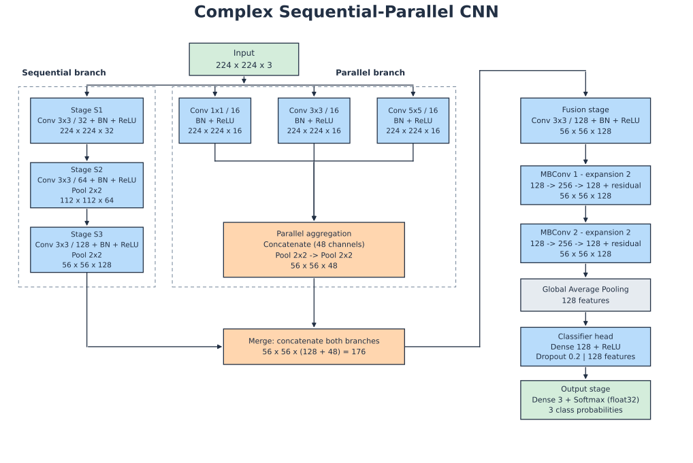
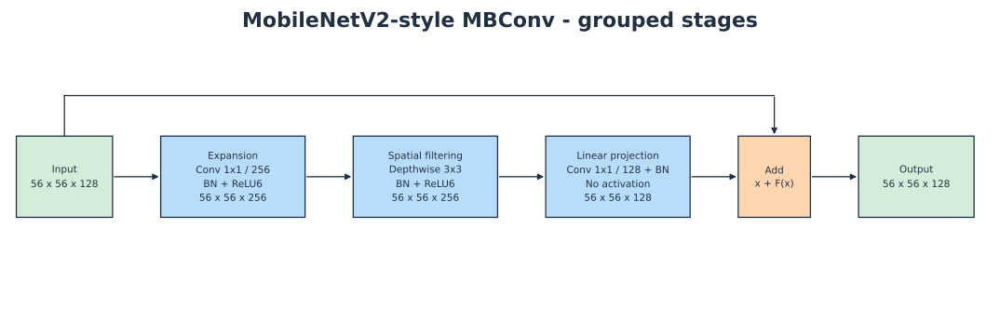

# Tài liệu nội bộ: notebook Complex CNN

Tài liệu này giải thích phiên bản `notebooks/model_complex_cnn.ipynb`. Notebook dùng tiếng Anh; phần giải thích nội bộ dùng tiếng Việt. Model tương ứng nằm trong `src/complex_cnn.py`; training helper nằm trong `src/train_complex_cnn.py`. Các số thứ tự cell và dòng ở phụ lục tính từ 1, trong từng cell của phiên bản hiện tại.

## 1. Notebook làm gì?

Notebook không tạo một dataset hoặc một patient split mới. Nó nhận manifest đã chia từ pipeline chung, tạo dataset train/validation, xây dựng model, huấn luyện từ đầu, lấy checkpoint có validation loss nhỏ nhất và đánh giá trên validation/test.

```text
split_manifest.csv + ảnh MATLAB
    → preprocessing chung → train/validation dataset
    → build_complex_cnn → train_model
    → checkpoint nhỏ nhất theo val_loss
    → validation metrics → test metrics + confusion matrix
```

`model` là model đang được huấn luyện; `best_model` là model được nạp lại từ checkpoint. Hai biến có thể mang weights khác nhau. Epoch cuối không nhất thiết là epoch tốt nhất.

## 2. Sơ đồ kiến trúc để dùng trong báo cáo





Chỉ giữ hai sơ đồ: toàn model và một MBConv riêng. Sơ đồ tổng thể gộp các phép Conv–BN–activation trong từng stage vào một ô; pooling của stage sequential cũng nằm trong ô tương ứng. Hai MBConv là hai ô riêng. Sơ đồ MBConv gộp thành expansion, spatial filtering, linear projection và residual Add, có đường identity rõ ràng. Việc gộp ô chỉ thay cách trình bày; kiến trúc code không thay đổi.

Các file cùng tên có bản `.png` và `.pdf` trong `docs/assets/`. SVG phù hợp nhúng vào README và chỉnh bằng công cụ vector; PNG phù hợp chèn vào Word/PowerPoint; PDF phù hợp tài liệu cần giữ nét khi phóng to. Sơ đồ dùng tiếng Anh để có thể đưa vào report.

Nhúng từ README ở gốc repository:

```markdown

```

Nhúng từ một README nằm trong `new_project/`:

```markdown

```

Sơ đồ biểu diễn model thực tế, không sao chép GoogLeNet. Nhánh song song có ba Conv chạy trực tiếp trên ảnh đầu vào; không có Conv 1×1 giảm kênh trước Conv 3×3/5×5, không có nhánh pooling độc lập như Inception gốc. Hai layer MaxPool của nhánh song song nằm **sau khi ghép ba nhánh con**.

## 3. Tensor đi qua model như thế nào?

Quy ước `H × W × C`, bỏ chiều batch. Mỗi batch thực tế là `B × H × W × C`. `Conv(k, c)` nghĩa là kernel k×k, c output channels. Các Conv thông thường có BN và ReLU; riêng MBConv có quy tắc activation khác được giải thích bên dưới.

| Vị trí | Biến đổi | Shape đầu ra |
|---|---|---|
| Input | Ảnh đã resize/normalize | 224 × 224 × 3 |
| Sequential 1 | Conv(3, 32) | 224 × 224 × 32 |
| Sequential 2 | Conv(3, 64) | 224 × 224 × 64 |
| `seq2_pool` | MaxPool 2×2, stride 2 | 112 × 112 × 64 |
| Sequential 3 | Conv(3, 128) | 112 × 112 × 128 |
| `seq3_pool` | MaxPool 2×2, stride 2 | 56 × 56 × 128 |
| Parallel con 1 | Conv(1, 16), trực tiếp từ Input | 224 × 224 × 16 |
| Parallel con 2 | Conv(3, 16), trực tiếp từ Input | 224 × 224 × 16 |
| Parallel con 3 | Conv(5, 16), trực tiếp từ Input | 224 × 224 × 16 |
| `par_concat` | Concatenate theo chiều kênh | 224 × 224 × 48 |
| `par_pool1` | MaxPool 2×2 | 112 × 112 × 48 |
| `par_pool` | MaxPool 2×2 | 56 × 56 × 48 |
| `merge_concat` | Ghép sequential và parallel | 56 × 56 × 176 |
| Fusion | Conv(3, 128), BN, ReLU | 56 × 56 × 128 |
| MBConv 1 | 128 → 256 → 128, residual | 56 × 56 × 128 |
| MBConv 2 | 128 → 256 → 128, residual | 56 × 56 × 128 |
| GAP | Lấy trung bình trên H,W cho mỗi kênh | 128 |
| Dense | Dense 128, ReLU | 128 |
| Dropout | Rate 0.2 | 128 |
| Output | Dense 3, softmax, float32 | 3 |

`padding="same"` với stride 1 giữ H,W cho Conv. MaxPool mặc định dùng stride bằng pool size nên chia đôi kích thước ở đây. Concatenate đòi hỏi H,W giống nhau nhưng cho phép C khác nhau; Add đòi hỏi toàn bộ shape giống nhau. Không thể thay Concatenate bằng Add vì 128 kênh và 48 kênh khác nhau, đồng thời hai phép toán mang ý nghĩa khác nhau.

## 4. Bản chất và lý do của từng thành phần

Các lý do dưới đây là diễn giải cơ chế và lựa chọn thiết kế hợp lý từ code. Chúng không chứng minh mỗi thành phần giúp tăng accuracy trong dataset này. Muốn kết luận như vậy phải có ablation kiểm soát seed, split, training budget và tiêu chí chọn model.

### 4.1. Input ba kênh

Pipeline chung resize ảnh về 224×224 và đưa pixel về [0,1]. MRI gốc là ảnh một kênh; preprocessing lặp ảnh thành ba kênh. Việc này thống nhất input giữa các model, không tạo thêm thông tin màu. Các trọng số Conv vẫn được học từ đầu; Complex CNN không dùng pretrained weights.

### 4.2. Nhánh sequential

Ba Conv 3×3 nối tiếp cho phép kết hợp đặc trưng đơn giản thành đặc trưng phức tạp hơn. ReLU giữa các Conv làm chuỗi này phi tuyến; nó không tương đương một phép Conv tuyến tính duy nhất. Số kênh 32→64→128 tăng khả năng biểu diễn khi độ phân giải giảm. Hai MaxPool giảm tính toán cho phần phía sau, đổi lại có thể mất chi tiết không gian nhỏ.

Conv đầu chưa pooling ngay: model còn cơ hội xử lý đặc trưng ở độ phân giải cao trước lần downsampling đầu. Đây là lựa chọn thiết kế, không phải một quy tắc bắt buộc của CNN.

### 4.3. Nhánh parallel đa kích thước kernel

Conv 1×1 trộn thông tin giữa các input channels tại mỗi pixel; nó không nhìn các pixel lân cận. Conv 3×3 và 5×5 nhìn lân cận rộng hơn. Ba nhánh chạy từ cùng Input nên có thể học các cách mô tả khác nhau của cùng ảnh trước khi bị nén không gian.

Mỗi nhánh chỉ có 16 kênh nhằm giới hạn chi phí, đặc biệt với kernel 5×5. Ghép tạo 48 kênh. Vì input chỉ có 3 kênh, các Conv này có ít parameters nhưng vẫn xử lý feature maps lớn 224×224: ít parameters không đồng nghĩa với ít bộ nhớ hoặc ít phép tính.

Không thể khẳng định nhánh 5×5 luôn nhận diện u lớn, còn 3×3 luôn nhận diện u nhỏ. Kernel size xác định vùng tiếp nhận cục bộ; nội dung mà filters thực sự học phụ thuộc dữ liệu và quá trình tối ưu.

### 4.4. Concatenate và fusion

Concatenate bảo toàn từng nhóm kênh của hai nhánh: 128 + 48 = 176. Bản thân Concatenate không có weights. Conv fusion 3×3 học cách kết hợp cả hai nhóm đặc trưng theo không gian và giảm 176 kênh xuống 128. BN và ReLU ổn định thang giá trị và thêm phi tuyến.

Fusion là phần có nhiều parameters nhất: 203.264 parameters, gồm Conv và BN. Vì vậy toàn bộ model không phải là mạng chỉ gồm các convolution rẻ; hai MBConv tiết kiệm chi phí ở đoạn sau, nhưng fusion vẫn là một Conv 3×3 đầy đủ.

### 4.5. BatchNormalization, không dùng bias và activation

Theo kênh, BN thực hiện dạng `y = gamma * (x - mean) / sqrt(variance + epsilon) + beta`. Khi train, mean/variance lấy từ batch và các chiều không gian; khi inference, dùng moving statistics đã tích lũy. Gamma/beta được học, còn moving mean/variance là trạng thái không được tối ưu bằng gradient.

Momentum 0.9 nghĩa là moving statistic giữ 90% giá trị cũ và nhận 10% thống kê batch mới. Epsilon 1e-3 giúp phép chia ổn định khi variance nhỏ. Vì có BN ngay sau Conv, `use_bias=False` tránh thêm bias thường dư thừa trong chuỗi này. ReLU là `max(0,x)`; ReLU6 là `min(max(0,x),6)`. [Tài liệu BN của Keras](https://keras.io/api/layers/normalization_layers/batch_normalization/)

**Gradient accumulation không biến BN batch 8 thành BN batch 32.** Mỗi forward train vẫn dùng batch vật lý 8 để tính BN. Chỉ gradient được tích lũy cho cập nhật weights. Đây là lý do train/inference đôi khi khác nhau rõ rệt khi batch nhỏ, cùng với Dropout và augmentation.

### 4.6. MBConv trong model này

Block là **MobileNetV2-style inverted residual với linear bottleneck**, expansion ratio 2 và stride 1:

```text
x: 56×56×128 ──────────────────────────────────────────┐
    Conv1×1: 128→256 → BN → ReLU6                       │
    Depthwise3×3: 256→256 → BN → ReLU6                  │
    Conv1×1: 256→128 → BN → Add(x) ←────────────────────┘
```

Expansion 1×1 tạo không gian 256 kênh để học biến đổi phong phú hơn. Depthwise 3×3 học lọc không gian riêng cho từng kênh; nó không tự trộn kênh. Projection 1×1 trộn kênh và đưa về 128. Shortcut giúp block học phần hiệu chỉnh `F(x)` trong `x + F(x)` và tạo đường truyền gradient trực tiếp.

Projection không có ReLU, và sau Add cũng không có activation: điều này giữ ý tưởng linear bottleneck, tránh ép thông tin trong biểu diễn hẹp qua một phi tuyến như ReLU. Hai block giữ nguyên H,W,C nên luôn cộng được với shortcut. Hàm hiện tại hard-code 128 và 256; không phải hàm MBConv tổng quát cho mọi input channels hoặc stride. [Paper MobileNetV2](https://arxiv.org/abs/1801.04381)

Block không có Squeeze-and-Excitation, Swish hay stochastic depth; không nên mô tả là bản sao MBConv của EfficientNet. Expansion ratio 2 thay vì 6 là lựa chọn cấu hình, không khiến nó trở thành một MBConv sai.

Về parameters, một Depthwise 3×3 trên 256 kênh có `3×3×256 = 2.304` weights. Một Conv 3×3 đầy đủ 256→256 có `3×3×256×256 = 589.824` weights. Đây chỉ là so sánh hai phép lọc không gian; MBConv còn có hai Conv 1×1 và BN, nên tổng block là 70.400 parameters.

### 4.7. GAP, Dense và Dropout

GAP biến mỗi feature map thành một giá trị trung bình: 56×56×128 → 128. Nó không có parameters. Flatten ở cùng vị trí sẽ tạo 401.408 phần tử; nối Dense 128 sau Flatten sẽ cần 51.380.352 parameters riêng cho Dense. GAP giúp tránh classifier quá lớn, nhưng làm mất vị trí không gian tường minh. Model này phân loại ảnh, không xuất bounding box hoặc segmentation mask.

Dense 128 kết hợp các đặc trưng đã tổng hợp. Dropout 0.2 bỏ ngẫu nhiên một phần activations trong train để giảm phụ thuộc quá mức vào một vài nút; inference không bỏ activations. Dropout không xóa cố định 20% weights.

Dense 3 sinh ba điểm số và softmax biến thành xác suất theo thứ tự `glioma`, `meningioma`, `pituitary tumor`. `dtype="float32"` giữ output cuối ở float32, kể cả khi phần bên trong dùng mixed precision. Softmax tổng bằng 1 không có nghĩa xác suất đã được calibration tốt.

### 4.8. Kiểm kê parameters

| Nhóm | Parameters, gồm trạng thái BN |
|---|---:|
| Sequential | 93.920 |
| Parallel | 1.872 |
| Fusion | 203.264 |
| MBConv 1 | 70.400 |
| MBConv 2 | 70.400 |
| Classifier | 16.899 |
| Tổng | **456.755** |

Conv không bias: `k² × Cin × Cout`. Depthwise với multiplier 1: `k² × Cin`. Dense có bias: `Cin × Cout + Cout`. BN mặc định có 4 giá trị/kênh, gồm gamma, beta, moving mean và moving variance. Tổng có 13 BN layers; 3.360 parameters là moving statistics không trainable, còn 453.395 là trainable. `count_params()` tính cả hai loại; nó không đo thời gian suy luận.

### 4.9. Linear projection: thực chất là phép biến đổi gì?

Xét **một vị trí** `(h,w)` trong feature map sau depthwise và ReLU6. Tại vị trí đó có vector `z ∈ R^256`: 256 giá trị, mỗi giá trị là phản hồi của một kênh. Conv 1×1 projection tính:

```text
u_j(h,w) = sum_{c=1..256} P[j,c] * z_c(h,w), j=1..128
u(h,w) = P z(h,w), với P có kích thước 128×256
```

P là ma trận **được học bằng gradient**, dùng chung tại mọi vị trí không gian. Mỗi output channel là một tổ hợp có trọng số của toàn bộ 256 input channels. Kernel Keras lưu có shape `(1,1,256,128)`; viết P theo quy ước vector cột cho dễ nhìn là `(128,256)`. `use_bias=False` nên riêng Conv này không cộng bias. H,W không đổi vì nó chỉ trộn kênh tại cùng vị trí, không lấy mẫu pixel lân cận.

**Projection** ở đây nghĩa là đưa biểu diễn từ không gian kênh rộng 256 về không gian hẹp 128. Nó không có nghĩa là copy 128 kênh đầu, lấy trung bình từng cặp, resize ảnh hay phép chiếu trực giao bắt buộc. Không có ràng buộc P trực giao hoặc `P²=P`; thậm chí P hình chữ nhật nên phép `P²` không phù hợp. Nó cũng không phải nghịch đảo của Conv expansion.

**Linear** ở đây chỉ việc Conv không có activation phi tuyến sau nó. Một phép ma trận không bias thỏa `P(a z1 + b z2) = a Pz1 + b Pz2`. So với Conv có ReLU, bản không activation giữ cả kết quả âm và dương. Ví dụ nhỏ thay cho 256→128:

```text
z = [2, -1, 3]
P = [[1, 0, -1],
     [0, 2,  1]]
Pz = [-1, 1]
ReLU(Pz) = [0, 1]
```

Sau ReLU, không phân biệt được output đầu từng là -1, -2 hay -100: cả ba bị đưa thành 0. Đây là ví dụ cơ chế mất phân biệt, không chứng minh projection không ReLU giữ được toàn bộ thông tin. Trong block thực tế z sau ReLU6 không âm, nhưng trọng số P có thể âm nên Pz vẫn có giá trị âm. Ví dụ với `z=[2,1,3]` và cùng P, kết quả là `[-1,5]`.

Giảm 256 xuống 128 đã là phép nén: rank của P tối đa 128, nên với không gian đầu vào đầy đủ có những vector khác nhau cho cùng output. Projection không bảo đảm khôi phục nguyên vẹn z. Ý tưởng là học giữ những tổ hợp hữu ích cho nhiệm vụ, tránh thêm một phép cắt phi tuyến ngay sau khi đã thu hẹp biểu diễn.

**Nhưng code còn BatchNorm sau Conv, vậy có thật sự tuyến tính không?** Trong inference, BN có moving mean/variance cố định:

```text
v_j = gamma_j * (u_j - moving_mean_j) / sqrt(moving_var_j + epsilon) + beta_j
    = a_j * u_j + b_j
v = D P z + b
```

Conv+BN lúc inference là phép **affine** theo z, không nhất thiết tuyến tính thuần vì có b. Trong train, thống kê BN phụ thuộc batch hiện tại nên không thể coi toàn chuỗi là một ma trận affine cố định áp dụng độc lập cho mọi mẫu. Tên linear projection/linear bottleneck trong thiết kế này muốn nói **không thêm activation như ReLU sau projection**, chứ không khẳng định BN trong mọi chế độ hoặc toàn bộ MBConv là hàm tuyến tính.

### 4.10. Linear bottleneck, expansion và inverted residual liên hệ thế nào?

Một **bottleneck** là biểu diễn hẹp hơn phần trung gian xung quanh nó. Trong block này input và output đều 128 kênh, phần giữa là 256: `narrow → wide → narrow`. Expansion ratio `t=256/128=2`; tên expansion nói về số kênh, không phải tăng H,W. Expansion có thể tạo các tổ hợp và phản hồi phi tuyến mới từ input, nhưng không tạo quan sát MRI mới.

Expansion 1×1 giống một Dense 128→256 dùng chung tại từng vị trí. BN và ReLU6 sau expansion tạo các phản hồi phi tuyến trong không gian rộng. Depthwise 3×3 sau đó xử lý ngữ cảnh không gian riêng cho từng kênh. Projection 1×1 là bước đưa các phản hồi rộng đó về biểu diễn 128 kênh mà shortcut có thể cộng được.

Lý do đặt ReLU6 ở phần rộng nhưng không ở đầu ra hẹp: nhiều kênh trung gian cho phép các phản hồi bổ sung nhau; ép đầu ra đã nén qua ReLU có thể làm mất thêm khả năng phân biệt. Đây là ý tưởng linear bottleneck của MobileNetV2; **không phải định lý rằng tăng kênh luôn tránh mất thông tin hoặc tăng accuracy**. [MobileNetV2, phần linear bottleneck và inverted residual](https://arxiv.org/html/1801.04381v4)

“Inverted” đối chiếu với bottleneck ResNet thường được mô tả `wide → narrow → wide`, shortcut nối hai biểu diễn rộng. Ở đây shortcut nối hai biểu diễn hẹp 128 kênh qua phần rộng 256. Vì stride=1 và input/output channels giống nhau, shortcut là identity: không cần Conv 1×1 đổi shape trên đường tắt.

```text
F(x) = BN_project(Conv1x1_project(
         ReLU6(BN_depthwise(Depthwise3x3(
           ReLU6(BN_expand(Conv1x1_expand(x)))
         )))
       ))
y = x + F(x)
```

Residual Add có nghĩa mỗi vị trí/kênh output bằng giá trị cũ cộng phần hiệu chỉnh học được. Concatenate sẽ đưa 128+128 thành 256 kênh và cần layer sau học kết hợp; Add giữ 128 kênh. Gradient theo input có đường trực tiếp qua `I` trong `dy/dx = I + J_F(x)`. Điều này hỗ trợ tối ưu hóa, không bảo đảm mọi gradient luôn ổn định. Nếu thêm ReLU sau Add, gradient và miền giá trị đầu ra sẽ khác kiến trúc đang chốt.

Hai MBConv nối tiếp có cùng cấu trúc nhưng **không chia sẻ weights**: tên `mb1_*` và `mb2_*` tạo hai tập tham số riêng. Block thứ hai nhận biểu diễn đã được block thứ nhất hiệu chỉnh; không phải chạy lại cùng một phép biến đổi hai lần.

### 4.11. Conv đầy đủ, depthwise và fusion khác nhau ở đâu?

Conv k×k đầy đủ tính một output channel bằng tổng trên cả k×k lân cận **và tất cả input channels**. Nó đồng thời lọc không gian và trộn kênh. Depthwise dùng một kernel k×k riêng cho mỗi input channel, không cộng chéo channels. Conv 1×1 trộn channels nhưng không mở rộng vùng không gian. MBConv tách các vai trò này: trộn kênh → lọc không gian → trộn/nén kênh.

Fusion nhận 176 channels gồm 128 của sequential và 48 của parallel. Mỗi filter 3×3 fusion có `3×3×176` weights; có 128 filters nên 202.752 Conv weights. Filter có thể kết hợp đồng thời một tín hiệu sequential và một tín hiệu parallel ở những vị trí lân cận. Concatenate chỉ đặt hai nhóm cạnh nhau theo channel axis; phần “học kết hợp” thực sự nằm ở fusion.

Với shape 56×56×128, một Conv 3×3 đầy đủ 128→128 cần 147.456 weights, trong khi một MBConv đang dùng cần 67.840 Conv/depthwise weights cộng 2.560 BN parameters = 70.400. So sánh này minh họa chi phí tham số tại cùng shape; không suy ra thời gian suy luận sẽ giảm theo cùng tỉ lệ, vì số layer, memory access và backend cũng ảnh hưởng.

### 4.12. Model nhìn vùng không gian rộng đến đâu?

Vùng tiếp nhận lý thuyết cục bộ của một đơn vị khi inference được tính bằng `r_new = r_old + (k-1)*j_old`, `j_new = j_old*stride`, bắt đầu `r=1, j=1`. BN với moving statistics cố định, activation và Conv1×1 không tăng r theo phép tính này. `j` là khoảng cách trên input giữa hai đơn vị kề nhau của feature map. Trong train, BN tính thống kê trên batch và không gian nên còn tạo phụ thuộc qua thống kê; bảng này không mô tả toàn bộ phụ thuộc đó hoặc vùng tiếp nhận hiệu dụng đo bằng gradient.

| Đường sequential | r sau layer | j sau layer |
|---|---:|---:|
| Conv3×3 đầu | 3 | 1 |
| Conv3×3 thứ hai | 5 | 1 |
| Pool2×2 thứ nhất | 6 | 2 |
| Conv3×3 thứ ba | 10 | 2 |
| Pool2×2 thứ hai | 12 | 4 |
| Fusion Conv3×3 | 20 | 4 |
| MBConv 1, Depthwise3×3 | 28 | 4 |
| MBConv 2, Depthwise3×3 | 36 | 4 |

Ba đường parallel, tính riêng trước khi trộn với sequential, đạt r=4/6/8 sau hai pooling. Fusion và hai depthwise đưa chúng lên 28/30/32. Sau fusion đã trộn nhiều đường nên một đơn vị cuối có thể phụ thuộc vùng tối đa 36×36 từ đường sequential; đây là vùng tiếp nhận lý thuyết cục bộ, không phải kích thước khối u mà model được bảo đảm nhận diện.

GAP lấy trung bình toàn bộ 56×56 vị trí, nên output classifier có thể phụ thuộc toàn ảnh thông qua các feature cục bộ. Điều đó không có nghĩa mỗi feature trước GAP đã nhìn trực tiếp toàn bộ ảnh, cũng không bảo đảm model học cấu trúc toàn cục theo cách mong muốn.

### 4.13. Từ đặc trưng sang quyết định ba lớp

GAP cho vector `g_c = mean_{h,w}(x_{h,w,c})`. Dense 128 tính `a=ReLU(Wg+b)`; Dropout chỉ trong train tạo phiên bản ngẫu nhiên của a và scale các giá trị còn lại theo inverted dropout. Dense cuối tính logits `s=Va+d`, softmax tính `p_k=exp(s_k)/sum_j exp(s_j)`. Sơ đồ gộp Dense–ReLU–Dropout thành classifier head và Dense–Softmax thành output stage; không thay đổi các layer trong code.

GAP giảm phụ thuộc vào vị trí tuyệt đối và giảm classifier parameters, đổi lại loại bỏ bố cục tường minh. Dense 128 học tương tác giữa các features đã tổng hợp. Dropout giảm việc một số features phối hợp quá đặc thù trên train; rate 0.2 không được chứng minh tối ưu chỉ bởi cơ chế này. Crossentropy khuyến khích p của lớp thật cao; argmax mới là bước biến p thành một nhãn.

## 5. Huấn luyện: ý nghĩa các lựa chọn

Loss categorical crossentropy phù hợp nhãn one-hot ba lớp: với một ảnh, `L = -log(p_true_class)`. Accuracy chỉ xét argmax nên hai model có cùng nhãn dự đoán có thể có loss khác nhau. Không có class weights hoặc label smoothing trong compile hiện tại.

Adam học với LR đầu 2e-4, không weight decay; các mặc định beta1=0.9, beta2=0.999, epsilon=1e-7 thuộc optimizer, khác BN momentum/epsilon. Tích lũy 4 bước lấy trung bình gradients rồi mới cập nhật weights. Batch hiệu dụng danh nghĩa 32; batch cuối có thể nhỏ hơn 8, và accumulation có thể đi qua ranh giới epoch. Không nên coi nó hoàn toàn tương đương một forward với batch 32. [Adam của Keras](https://keras.io/api/optimizers/adam/)

CosineDecay giảm LR theo `lr(t)=lr0*[alpha+(1-alpha)*(1+cos(pi*min(t,T)/T))/2]`, với `T=train_batches*60`, `alpha=1e-6/2e-4=0.005`. Sau T, LR ở sàn 1e-6. Trong Keras 3.15.1 đang dùng, schedule lấy bộ đếm bước thực trước phép chia accumulation (`optimizer._iterations`); không chia decay_steps thêm cho 4. Cấu hình này giữ nguyên bản chốt. 2.071 ảnh train với batch 8 tạo 259 batches/epoch và 15.540 decay steps. Khi dùng loss scaling, bước bị bỏ do gradient không hữu hạn có thể ảnh hưởng tiến độ optimizer; không suy diễn từ epoch sang bước mà bỏ qua điều đó. [Quy tắc schedule với accumulation](https://keras.io/api/optimizers/adam/)

EarlyStopping chỉ bắt đầu xét ở chỉ số epoch 60, tức epoch 61 khi đếm từ 1; patience 20, min_delta 0. ModelCheckpoint theo dõi từ đầu và lấy `val_loss` thấp nhất toàn bộ run. `restore_best_weights=False` không phải quên lấy weights tốt nhất: phần đánh giá nạp lại checkpoint riêng. Epoch tốt nhất được lấy bằng argmin loss, cộng 1 để chuyển chỉ số 0-based.

Seed 42 giúp kiểm soát random streams nhưng không bảo đảm bitwise reproducibility trên mọi backend/device. Dataset train shuffle và augmentation ngẫu nhiên; `fit(shuffle=False)` không tắt shuffle vốn đã thực hiện trong data loader. Validation/test không augmentation. Train accuracy được đo khi Dropout hoạt động và ảnh được augmentation; validation accuracy được đo trong inference mode, nên không cần luôn nhỏ hơn train accuracy.

### 5.1. “Chọn hyperparameter” là chọn cái gì?

**Parameters** là weights được học bằng backpropagation, chẳng hạn kernel Conv hoặc gamma/beta BN. **Hyperparameters** là các quyết định trước hoặc ngoài quá trình cập nhật weights: số channels, số blocks, LR, dropout, batch, patience. **Quy ước chung** là các lựa chọn cần giữ thống nhất để so sánh nhóm, như split, class mapping, input size và seed. Không nên tune lại split của từng model để lấy score thuận lợi hơn.

Notebook hiện tại **chạy một cấu hình đã chốt**, không có grid search, random search, Bayesian optimization hay vòng lặp tự chọn hyperparameters. Nó tìm epoch/checkpoint tốt nhất *trong cấu hình này*. Việc người dùng đã thử các phiên bản rồi chọn bản này là lựa chọn thủ công; code hiện tại không đủ để khẳng định từng con số là tối ưu hoặc rằng có một quy trình search có kiểm soát cho toàn bộ lịch sử.

Phải tách ba câu hỏi:

1. **Thiết kế:** vì sao cấu trúc/hyperparameter này có ý nghĩa về cơ chế và tài nguyên?
2. **Lựa chọn cấu hình:** cấu hình A hay B tổng quát hóa tốt hơn trên validation với cùng điều kiện?
3. **Lựa chọn epoch:** trong một cấu hình đã cố định, lấy weights của epoch nào? Notebook trả lời câu này bằng min val_loss.

Không dùng epoch tốt nhất theo test accuracy để giải thích cách chọn model; callbacks không đọc test. Test của project đã được xem trong các lần thử trước, nên không thể từ việc callbacks chỉ dùng validation suy ra toàn bộ quá trình chọn hyperparameter trong lịch sử chưa từng chịu ảnh hưởng test.

### 5.2. Vì sao các giá trị hiện tại hợp lý, và kiểm tra chúng bằng cách nào?

| Nhóm | Giá trị đang chốt | Lập luận thiết kế | Cách kiểm chứng khi nghiên cứu thêm |
|---|---|---|---|
| Input/split/seed | 224; manifest chung; 42 | So sánh cùng dữ liệu/độ phân giải và kiểm soát random stream | Giữ cố định khi so sánh; sau đó dùng nhiều seeds để đo độ ổn định |
| Channels sequential | 32→64→128 | Tăng chiều biểu diễn khi giảm H,W, giới hạn bộ nhớ phần đầu | So widths nhỏ/lớn với cùng budget; xem validation, parameters, thời gian |
| Parallel kernels | 1,3,5; 16 channels/nhánh | Bổ sung các lân cận khác nhau với chi phí kênh nhỏ | Bỏ/tách từng nhánh trong ablation, không chỉ nhìn score của model đầy đủ |
| Fusion | 3×3, 176→128 | Trộn hai nguồn đặc trưng và đưa shape về input của MBConv | So 1×1/3×3 hoặc fusion width khác; tính cả chi phí |
| MBConv | 2 blocks; expansion 2 | Thêm depth/phi tuyến và residual với số parameters vừa phải | So 0/1/2 blocks và expansion 2/4; kiểm soát budget |
| BN | momentum 0.9; epsilon 1e-3 | Cân bằng độ cập nhật moving statistics và ổn định phép chia | Theo dõi train/inference gap, thử momentum có kiểm soát; không thay đổi sau khi nhìn test |
| Batch/accumulation | 8×4 | Giới hạn activations bộ nhớ trong forward nhưng lấy gradient trung bình từ nhiều bước | Kiểm tra memory và tốc độ; nhớ BN batch vẫn là 8 |
| Optimizer | Adam, không weight decay | Cập nhật theo moments của gradient; giữ bản baseline không thêm regularizer weights | So optimizer/weight decay như một thí nghiệm riêng, không đổi nhiều thứ cùng lúc |
| LR | 2e-4 | Mức khởi đầu tương đối thận trọng cho cấu hình này | Xem train loss có giảm ổn định không; thử các mức theo thang log rồi xác nhận bằng validation |
| Schedule | cosine 60 epoch, sàn 1e-6 | Bước lớn đầu để học, bước nhỏ cuối để tinh chỉnh | So schedules/budget cùng tiêu chí; kiểm tra bước schedule thật |
| Dropout | 0.2 | Regularization ở head, không phá toàn bộ feature maps trước GAP | So 0/0.1/0.2/0.3; xem underfit/overfit và macro/per-class metrics |
| Budget | max 90 epoch | Dành khoảng 60 epoch decay và 30 epoch ở vùng LR thấp | Xem đường loss và tiêu chí dừng, không mặc định cứ train lâu hơn là tốt |
| Early stopping | start=60; patience=20; delta=0 | Không dừng trước giai đoạn LR thấp; chờ để không phản ứng ngay với dao động loss | So patience theo noise của validation và budget thực tế |
| Chọn checkpoint | min val_loss | Loss dùng xác suất lớp thật, phản ánh khác biệt độ tự tin mà accuracy bỏ qua | Theo dõi thêm macro F1; nếu đổi tiêu chí phải tuyên bố trước khi so sánh |

Các dải thử trong cột cuối là **gợi ý quy trình nghiên cứu tiếp**, không phải các dải search đã được chạy hoặc chứng minh tốt nhất. LR 2e-4 không được tính từ một công thức bắt buộc, momentum 0.9 không tự suy ra từ batch 8, và dropout 0.2 không tự suy ra từ số ảnh. Những con số này cần bằng chứng validation khi muốn bảo vệ lựa chọn định lượng.

Một cách tune dễ giải thích trong report: giữ pipeline chung → xác định baseline và metric chọn cấu hình → thử vài LR theo thang log → thử regularization/capacity có kiểm soát → rerun ứng viên trên cùng seeds → khóa cấu hình → đánh giá test. Nếu chỉ thay một yếu tố mỗi lần, dễ quy kết tác động hơn nhưng vẫn có thể bỏ lỡ tương tác; random/Bayesian search phù hợp khi search space lớn hơn. Notebook này không triển khai các phương thức đó.

### 5.3. Đọc dấu hiệu để điều chỉnh thay vì chọn số tùy ý

Train loss không giảm: kiểm tra pipeline, labels, gradient, LR và capacity trước; không kết luận ngay phải tăng số layers. Train loss dao động lớn hoặc không hữu hạn: LR quá cao là một khả năng, nhưng dữ liệu/precision/normalization cũng có thể gây ra. Train tốt nhưng validation kém: xem patient split, domain shift, capacity, augmentation và regularization. Cả train/validation đều kém: regularization quá mạnh hoặc capacity/budget không đủ là các khả năng.

Validation accuracy cao nhưng macro recall thấp: có thể model thiên về lớp nhiều ảnh; đọc per-class metrics thay vì chỉ tune theo accuracy. Đây là dấu hiệu cần phân tích, không phải bằng chứng một nguyên nhân duy nhất. Để so fair, ghi cả cấu hình, seed, training budget, checkpoint criterion và hardware; không chỉ ghi score tốt nhất trong nhiều lần thử.

### 5.4. Callback chạy lúc nào và phối hợp ra sao?

Callback là đối tượng được `fit` gọi ở các sự kiện, không phải một layer trong graph và không thêm parameters. Thứ tự list có tác dụng **trong cùng một sự kiện**; không phải chạy xong toàn bộ TerminateOnNaN rồi mới chạy cả CSVLogger.

```text
fit bắt đầu → on_train_begin
  mỗi epoch:
    mỗi train batch → forward/loss/backward → on_train_batch_end
    validation → tạo logs: loss, accuracy, val_loss, val_accuracy
    on_epoch_end → CSVLogger → ModelCheckpoint → EarlyStopping
  kết thúc → on_train_end
train_model → lưu history và learning curve
notebook → load_model(CHECKPOINT_PATH) → đánh giá
```

`TerminateOnNaN` chủ yếu xử lý batch-end; nó không phải một phép kiểm tra validation loss chuyên biệt. CSVLogger/ModelCheckpoint/EarlyStopping thực hiện vai trò chính của chúng ở epoch-end. Logs là dictionary metric mà Keras cung cấp tại event, không phải evaluation JSON sau train.

| Callback trong notebook | Tác dụng | Không làm gì |
|---|---|---|
| `TerminateOnNaN()` | Đặt cờ stop khi train loss batch không hữu hạn | Không sửa weights hỏng; không tự hạ LR hoặc rollback checkpoint |
| `CSVLogger(training_log.csv)` | Ghi một hàng metrics mỗi epoch | Không quyết định model tốt; không lưu toàn bộ weights |
| `ModelCheckpoint(..., val_loss, min, save_best_only=True)` | Lưu toàn model khi val_loss đạt minimum mới từ epoch đầu | Không dừng train; không biết macro F1 nếu không dùng làm monitor |
| `EarlyStopping(..., val_loss, min, patience=20, start=60)` | Quyết định dừng sau giai đoạn bắt đầu xét | Không đảm bảo trả model global-best khi restore=False |

**TerminateOnNaN:** callback đặt `model.stop_training=True` theo hành vi mặc định hiện tại; không phải luôn ném exception. Helper sau fit vẫn có thể cố lưu history và gặp lỗi nếu history chứa NaN do `save_json(allow_nan=False)`. Nó là chặn train tiếp, không phải quy trình tự phục hồi. Nếu gradient bị loss scaling bỏ một update trong khi loss vẫn hữu hạn, đây cũng không đồng nghĩa callback này sẽ kích hoạt.

**CSVLogger:** `epoch` trong CSV là chỉ số 0-based của Keras; đồ thị/best_epoch hiển thị 1-based. Các columns metric có thể được sắp xếp theo tên, không nên suy ra thứ tự lớp từ vị trí cột. Tên file riêng cho run tránh lẫn các lần train.

**ModelCheckpoint:** mặc định `save_freq="epoch"`, `save_weights_only=False`, nên file `.keras` chứa model và trạng thái liên quan để load lại, không chỉ một array weights. Với mode=min, mỗi epoch so `current val_loss < best_global`; bằng nhau không ghi model mới. `save_best_only=True` giữ file cùng path được cập nhật khi tốt hơn, không tạo 90 file epoch. Nó không có min_delta trong lời gọi hiện tại. [ModelCheckpoint API](https://keras.io/api/callbacks/model_checkpoint/)

**EarlyStopping:** index 0..59 bị bỏ qua; index 60, tức epoch 61, là lần đầu tạo best của giai đoạn theo dõi. Những minimum trước epoch 61 không được lấy làm baseline của callback này. Khi loss giảm dưới best đang theo dõi với min_delta=0, cập nhật best và reset wait; còn lại tăng wait. Wait đạt 20 thì đặt cờ stop. `restore_best_weights=False` giữ model trong RAM ở weights cuối; notebook load file global-best riêng. [EarlyStopping API](https://keras.io/api/callbacks/early_stopping/)

Hai đối tượng checkpoint và early stopping giữ **hai biến best riêng**. Một đối tượng nhìn toàn run, một đối tượng nhìn phần từ epoch 61. Cho dù cùng monitor, chúng không có nghĩa là cùng chọn một epoch. Đó là lý do cần nạp checkpoint sau fit thay vì đánh giá trực tiếp biến model hoặc đổi restore_best_weights=True rồi nghĩ đã lấy global-best.

Pseudocode tương đương ý đồ cấu hình hiện tại:

```python
best_global = None
best_tail = None
wait = 0
for epoch_index in range(90):
    train_and_validate()
    log_csv()
    if best_global is None or val_loss < best_global:
        best_global = val_loss
        save_full_model()
    if epoch_index < 60:
        continue
    if best_tail is None or val_loss < best_tail:
        best_tail = val_loss
        wait = 0
    else:
        wait += 1
        if wait >= 20:
            break
best_model = load_global_checkpoint()
```

Pseudocode chỉ minh họa logic epoch có validation loss hữu hạn, không thay thế toàn bộ Keras callback implementation. Nó bỏ các event batch, xử lý lỗi và baseline vì notebook không đặt baseline.

### 5.5. Ví dụ thật: vì sao run đã chốt đi hết 90 epoch?

Dữ liệu lấy từ `reports/complex_cnn_history.json`, không phải ví dụ giả:

| Epoch, đếm từ 1 | val_loss | Diễn giải |
|---:|---:|---|
| 46 | 0.163978 | Minimum trong 60 epoch đầu, checkpoint đã giữ nó |
| 60 | 0.173678 | EarlyStopping vẫn chưa xét epoch này |
| 61 | 0.177989 | Khởi tạo best_tail; chưa tốt hơn global-best epoch 46 |
| 62 | 0.176470 | Cải thiện best_tail nên reset wait; chưa thay checkpoint epoch 46 |
| 83 | 0.165843 | Vẫn lớn hơn loss epoch 46 |
| 84 | **0.162999** | Tốt hơn global-best và tail-best: cập nhật checkpoint và reset wait |
| 85 | 0.167004 | Không tốt hơn epoch 84, bắt đầu tích wait |
| 90 | 0.175046 | Hết budget, mới 6 epoch không cải thiện sau epoch 84 |

Vì patience=20 chưa đạt sau epoch 84, run kết thúc bởi `epochs=90`, không phải early stopping ở epoch 84. Epoch 84 là **epoch được chọn**, epoch 90 là **epoch kết thúc train**. Validation loss epoch 61 được EarlyStopping xem là baseline tail dù checkpoint từ epoch 46 tốt hơn nó. Hai sự kiện này có thể cùng xảy ra mà không mâu thuẫn.

Nếu giai đoạn tail không cải thiện lần nào sau baseline epoch 61, với cấu hình này sẽ đạt 20 lần không cải thiện tại epoch 81. Đây là diễn giải mốc, không phải lịch dừng thật của run. Nếu cho train thêm sau 90 thì không thể khẳng định sẽ dừng ở một epoch cụ thể, vì những epoch mới có thể cải thiện; notebook đang khóa budget 90.

### 5.6. Schedule khác callback điều chỉnh learning rate

CosineDecay là đối tượng schedule được truyền vào Adam, không nằm trong callbacks. Nó lấy số bước optimizer để trả LR; không chờ val_loss plateau rồi mới giảm. `ReduceLROnPlateau` không được dùng. `start_from_epoch=60` của EarlyStopping không phải warm-up LR: cấu hình không có đoạn LR tăng dần ban đầu. [CosineDecay API](https://keras.io/api/optimizers/learning_rate_schedules/cosine_decay/)

Với T=15.540, các mốc toán học của schedule là LR(0)=0.0002, LR(T/2)=0.0001005, LR(T)=0.000001. Sau T giữ sàn. Epoch chỉ gần tương ứng các mốc theo train batches; schedule thực sự chạy theo bộ đếm optimizer. Gradient accumulation không làm thay số decay_steps thành T/4 trong phiên bản này.

Chọn min val_loss là lựa chọn ưu tiên xác suất lớp thật. Macro F1/recall là metric bổ sung quan trọng khi lớp mất cân bằng nhưng không quyết định checkpoint ở notebook hiện tại. Nếu muốn chọn theo macro F1, phải tính nó trong validation callback/logs và đổi monitor trước thí nghiệm, rồi đánh giá lại theo quy trình đã tuyên bố; không đổi tiêu chí sau khi thấy test nào đẹp hơn.

## 6. File được tạo và vai trò các module

Mỗi Run All tạo một thư mục timestamp riêng. Notebook lưu split đã dùng và model summary; helper training lưu history JSON và learning curve. Callbacks lưu training log và checkpoint. Đánh giá validation lưu metrics/ma trận riêng; `evaluate_model` lưu test metrics/ma trận cùng số parameters và inference time.

`load_split_manifest` đọc manifest chung; `build_tf_dataset` đọc MATLAB, crop/resize/normalize, lặp kênh, one-hot và train-only augmentation. Nó dùng TensorFlow cho dữ liệu nhưng model Keras chạy với backend torch. Mask phục vụ preprocessing, không được đưa thành target segmentation của model này.

`assert_cardinality` còn trong pipeline để khai báo/kiểm tra số batches của dataset generator, không phải kiểm tra patient leakage. Dòng `manifest.to_csv` lưu bản manifest đã dùng, không chia lại dữ liệu. Notebook không còn các câu lệnh Python `assert` hoặc khối `training_config`.

## 7. Những điểm cần mô tả đúng trong report

- Complex CNN là model custom từ đầu, có ý tưởng đa kernel và inverted residual; không phải GoogLeNet/EfficientNet hoàn chỉnh.
- Kết quả là phân loại từng ảnh/slice. Chia theo patient ngăn chia ảnh của cùng patient vào nhiều split, nhưng không tự biến metric thành metric theo patient.
- Test đã được xem trong các thử nghiệm trước; kết quả giữ tính thăm dò, không nên trình bày như đánh giá trên một test cohort hoàn toàn chưa từng được sử dụng.
- Macro F1 không phải harmonic mean của macro precision và macro recall; xem tài liệu evaluation.
- Những lập luận về đa tỉ lệ, regularization và residual là cơ chế thiết kế. Không khẳng định mức cải thiện định lượng nếu chưa có thí nghiệm ablation.

## 8. Giải thích từng dòng code

Phụ lục dưới đây ghi lại chính xác từng dòng không trống trong mỗi code cell, kể cả các dòng nối tiếp lời gọi hàm và cell code đang được comment. Dòng trống chỉ phân cách khối nên không được liệt kê. Khi thay đổi notebook, cần cập nhật phụ lục để tránh lệch số dòng.

<!-- LINE_BY_LINE_APPENDIX -->

### Cell 3 — `complex-final-02`

| Dòng | Code | Giải thích |
|---:|---|---|
| 1 | `import os` | Nạp module thao tác biến môi trường; thiết lập backend phải có hiệu lực trước khi import Keras. |
| 2 | `import torch` | Nạp PyTorch, backend tính toán model đang sử dụng. |
| 4 | `os.environ["KERAS_BACKEND"] = "torch"` | Chỉ định backend torch cho Keras trước khi import Keras/TensorFlow. |
| 5 | `DEVICE = "cpu"` | Chọn nơi tạo/chạy tensor model; dòng comment chỉ có hiệu lực khi được bỏ comment. |
| 6 | `PRECISION = "float32"` | Chọn policy float32 hoặc mixed_float16, được áp dụng sau khi import Keras. |
| 7 | `os.environ["KERAS_TORCH_DEVICE"] = DEVICE` | Đặt device của backend theo DEVICE trước khi backend khởi tạo. |

### Cell 4 — `optional-gpu-code`

| Dòng | Code | Giải thích |
|---:|---|---|
| 1 | `# DEVICE = "cuda"` | Dòng đang comment nên không thực thi. Chọn nơi tạo/chạy tensor model; dòng comment chỉ có hiệu lực khi được bỏ comment. |
| 2 | `# PRECISION = "mixed_float16"` | Dòng đang comment nên không thực thi. Chọn policy float32 hoặc mixed_float16, được áp dụng sau khi import Keras. |
| 3 | `# os.environ["KERAS_TORCH_DEVICE"] = DEVICE` | Dòng đang comment nên không thực thi. Đặt device của backend theo DEVICE trước khi backend khởi tạo. |
| 4 | `# torch.backends.cudnn.benchmark = True` | Dòng đang comment nên không thực thi. Bật chọn thuật toán cuDNN theo hiệu năng; có thể làm kết quả không hoàn toàn deterministic. |
| 5 | `# torch.backends.cuda.matmul.allow_tf32 = False` | Dòng đang comment nên không thực thi. Tắt TF32 cho phép nhân ma trận CUDA, giữ setting runtime của bản chốt. |
| 6 | `# torch.backends.cudnn.allow_tf32 = False` | Dòng đang comment nên không thực thi. Tắt TF32 trong cuDNN, giữ setting runtime của bản chốt. |

### Cell 6 — `shared-module-imports`

| Dòng | Code | Giải thích |
|---:|---|---|
| 1 | `from pathlib import Path` | Dùng Path để ghép, kiểm tra, tạo và ghi đường dẫn thay vì ghép chuỗi thủ công. |
| 2 | `from datetime import datetime` | Lấy thời điểm chạy để đặt tên thư mục kết quả duy nhất. |
| 3 | `import sys` | Cho phép thêm thư mục project vào nơi Python tìm các module src. |
| 4 | `import numpy as np` | Dùng NumPy cho arrays, ceil, argmin và xử lý dự đoán. |
| 5 | `import pandas as pd` | Dùng pandas đọc/tổng hợp manifest và trình bày metrics dạng bảng. |
| 7 | `import tensorflow as tf` | Nạp TensorFlow để chạy tf.data và đặt seed của pipeline ảnh. |
| 8 | `import keras` | Nạp Keras sau khi đã cấu hình backend và device. |
| 9 | `from IPython.display import display, Image` | Hiển thị bảng và ảnh báo cáo trong notebook; Image chỉ đọc ảnh, không tính metric. |
| 11 | `PROJECT_DIR = next(path for path in (` | Lấy ứng viên thư mục đầu tiên chứa src/data_loader.py; nếu không có sẽ phát sinh StopIteration. |
| 12 | `Path.cwd(), Path.cwd() / "new_project",` | Liệt kê ứng viên từ working directory, thư mục con dự kiến và các thư mục cha; dấu * bung iterable parents. |
| 13 | `Path.cwd() / "multi-class-brain-tumor-classification/new_project", *Path.cwd().parents,` | Liệt kê ứng viên từ working directory, thư mục con dự kiến và các thư mục cha; dấu * bung iterable parents. |
| 14 | `) if (path / "src/data_loader.py").is_file())` | Lọc ứng viên bằng sự tồn tại của file data loader rồi đóng generator cho next. |
| 15 | `sys.path.insert(0, str(PROJECT_DIR))` | Đặt project directory ở đầu đường dẫn import để nạp đúng package src của project. |
| 16 | `from src.train_complex_cnn import train_model` | Nạp helper fit, lưu history JSON và learning curve. |
| 17 | `from src.data_loader import build_tf_dataset` | Nạp data loader dùng chung để bảo đảm cùng preprocessing giữa các model. |
| 18 | `from src.preprocessing import load_split_manifest` | Nạp hàm đọc manifest đã chia; notebook không tạo split mới. |
| 19 | `from src.evaluation import collect_predictions, compute_metrics, evaluate_model, save_json, plot_confusion_matrix` | Nạp các hàm thu predictions, tính metric, điều phối test, lưu JSON và vẽ ma trận. |

### Cell 8 — `complex-final-04`

| Dòng | Code | Giải thích |
|---:|---|---|
| 1 | `SEED = 42` | Seed 42 cho random streams; không bảo đảm bitwise reproducibility trên mọi thiết bị. |
| 2 | `IMAGE_SIZE = 224` | Cạnh ảnh 224, input model có shape 224×224×3. |
| 3 | `BATCH_SIZE = 8` | Batch vật lý 8 ảnh mỗi forward; BN vẫn dùng batch vật lý này. |
| 4 | `ACCUMULATION_STEPS = 4` | Tích lũy gradient 4 bước trước cập nhật; batch hiệu dụng danh nghĩa 32. |
| 5 | `EPOCHS = 90` | Số epoch tối đa 90; early stopping có thể dừng sớm. |
| 6 | `DECAY_EPOCHS = 60` | Budget 60 epoch dùng tính decay_steps và mốc bắt đầu early stopping. |
| 7 | `LEARNING_RATE = 2e-4` | LR ban đầu 2e-4 của Adam/CosineDecay. |
| 8 | `MIN_LEARNING_RATE = 1e-6` | LR sàn 1e-6 sau quá trình decay. |
| 9 | `BN_MOMENTUM = 0.9` | BN moving statistics giữ 90% cũ và 10% mới; khác Adam beta1. |
| 10 | `BN_EPSILON = 1e-3` | Hằng số 1e-3 cộng vào variance trong BN; khác epsilon của Adam. |
| 11 | `DROPOUT_RATE = 0.2` | Xác suất bỏ activation 0.2 trong train; inference tắt Dropout. |
| 12 | `PATIENCE = 20` | Early stopping chờ 20 epoch không cải thiện sau mốc bắt đầu xét. |
| 13 | `MIN_DELTA = 0.0` | Mức cải thiện tối thiểu 0; cần val_loss giảm để được tính cải thiện. |
| 15 | `keras.utils.set_random_seed(SEED)` | Đặt seed các random generators mà Keras quản lý (Python/NumPy/backend). |
| 16 | `tf.random.set_seed(SEED)` | Đặt riêng seed TensorFlow vì pipeline tf.data/augmentation vẫn dùng TensorFlow. |
| 17 | `keras.mixed_precision.set_global_policy(PRECISION)` | Áp dụng PRECISION cho các layer được tạo sau dòng này; output cuối vẫn khai báo float32. |
| 18 | `torch.set_num_threads(8)` | Giới hạn 8 threads cho tính toán CPU của torch, không đổi số thread TensorFlow. |
| 20 | `MODEL_NAME = "complex_cnn"` | Tên chuẩn complex_cnn dùng đặt tên checkpoint/report, không phải tên thư mục timestamp. |
| 21 | `RUN_DIR = PROJECT_DIR / "runs" / f"complex_cnn_seed42_{datetime.now():%Y%m%d_%H%M%S_%f}"` | Tạo đường dẫn run từ timestamp đến microsecond để các lần train không ghi đè kết quả cũ. |
| 22 | `REPORTS_DIR = RUN_DIR / "reports"` | Chọn thư mục reports nằm trong run vừa tạo. |
| 23 | `CHECKPOINT_PATH = RUN_DIR / "models" / f"{MODEL_NAME}_best.keras"` | Chọn file models/complex_cnn_best.keras trong run này. |
| 24 | `REPORTS_DIR.mkdir(parents=True, exist_ok=False)` | Tạo thư mục và các thư mục cha; exist_ok=False báo lỗi nếu đã tồn tại, tránh dùng lại run ngoài ý muốn. |
| 25 | `CHECKPOINT_PATH.parent.mkdir(parents=True, exist_ok=False)` | Tạo thư mục và các thư mục cha; exist_ok=False báo lỗi nếu đã tồn tại, tránh dùng lại run ngoài ý muốn. |
| 26 | `print("Results:", RUN_DIR)` | In thông tin ngắn để nhận biết đường dẫn kết quả hoặc epoch tốt nhất; không ảnh hưởng huấn luyện. |

### Cell 10 — `complex-final-06`

| Dòng | Code | Giải thích |
|---:|---|---|
| 1 | `manifest = load_split_manifest(PROJECT_DIR / "data/processed/split_manifest.csv")` | Đọc split manifest chung bằng helper; không shuffle/chia lại patients trong notebook. |
| 2 | `RAW_DIR = PROJECT_DIR / "data/raw"` | Đặt thư mục dữ liệu gốc để data loader tìm các file trong manifest. |
| 3 | `split_counts = manifest.groupby(["split", "class_name"]).size().unstack(fill_value=0)` | Group theo split và class_name, đếm ảnh, pivot lớp thành cột và điền 0 cho nhóm không có ảnh. |
| 4 | `display(split_counts)` | Hiển thị số ảnh mỗi lớp ở train/validation/test để đọc phân bố, không dùng test để chọn model. |
| 6 | `train_dataset = build_tf_dataset(` | Bắt đầu tạo dataset cho split tương ứng bằng pipeline chung; generator đọc ảnh khi được lặp. |
| 7 | `manifest, RAW_DIR, split="train", image_size=IMAGE_SIZE,` | Truyền manifest, thư mục ảnh và split cần lấy; image_size/batch_size dùng cấu hình chung. |
| 8 | `batch_size=BATCH_SIZE, training=True, seed=SEED,` | Dùng batch vật lý 8 trong data loader. True bật shuffle/augmentation; mặc định False cho validation/test. Đặt seed pipeline dữ liệu theo SEED. |
| 9 | `)` | Đóng cấu trúc/lời gọi đã mở ở các dòng trên; không tạo một bước xử lý mới. |
| 10 | `validation_dataset = build_tf_dataset(` | Bắt đầu tạo dataset cho split tương ứng bằng pipeline chung; generator đọc ảnh khi được lặp. |
| 11 | `manifest, RAW_DIR, split="validation", image_size=IMAGE_SIZE,` | Truyền manifest, thư mục ảnh và split cần lấy; image_size/batch_size dùng cấu hình chung. |
| 12 | `batch_size=BATCH_SIZE,` | Dùng batch vật lý 8 trong data loader. |
| 13 | `)` | Đóng cấu trúc/lời gọi đã mở ở các dòng trên; không tạo một bước xử lý mới. |
| 14 | `train_batches = int(np.ceil(manifest["split"].eq("train").sum() / BATCH_SIZE))` | Đếm ảnh của split, chia batch size và làm tròn lên; batch cuối nhỏ vẫn tính là một batch. |
| 15 | `validation_batches = int(np.ceil(manifest["split"].eq("validation").sum() / BATCH_SIZE))` | Đếm ảnh của split, chia batch size và làm tròn lên; batch cuối nhỏ vẫn tính là một batch. |
| 16 | `train_dataset = train_dataset.apply(tf.data.experimental.assert_cardinality(train_batches))` | Khai báo/kiểm tra số batches của dataset generator, giúp Keras biết độ dài epoch; không kiểm tra patient leakage. |
| 17 | `validation_dataset = validation_dataset.apply(tf.data.experimental.assert_cardinality(validation_batches))` | Khai báo/kiểm tra số batches của dataset generator, giúp Keras biết độ dài epoch; không kiểm tra patient leakage. |
| 19 | `manifest.to_csv(REPORTS_DIR / "split_manifest_used.csv", index=False)` | Lưu bản manifest đã dùng trong run, index=False tránh ghi index DataFrame; không tạo split mới. |

### Cell 12 — `complex-final-08`

| Dòng | Code | Giải thích |
|---:|---|---|
| 1 | `layers = keras.layers` | Đặt tên ngắn cho namespace layer; không tạo layer hay weights ở dòng này. |
| 3 | `def mbconv_block(x, name, bn_momentum=0.9, norm_epsilon=1e-3):` | Định nghĩa hàm `mbconv_block` và các tham số; thân hàm chỉ chạy khi được gọi. Xem phần cơ chế của hàm tương ứng ở trên. |
| 4 | `"""128 -> 256 -> 128 channels, depthwise3x3, linear projection, shortcut."""` | Docstring mô tả nhiệm vụ hoặc cấu trúc của hàm/module; không thực hiện thuật toán. |
| 5 | `shortcut = x` | Giữ tensor input làm identity shortcut; không copy dữ liệu sang một model khác. |
| 6 | `r = layers.Conv2D(256, 1, padding="same", use_bias=False,` | Tạo Conv2D học trộn kênh và lọc không gian, dùng kernel/output channels trên dòng; same giữ H,W và no bias vì có BN sau đó. |
| 7 | `name=f"{name}_expand")(x)` | Đặt tên layer duy nhất rồi nối layer vào tensor ghi cuối dòng; tên giúp đọc summary và load graph. |
| 8 | `r = layers.BatchNormalization(momentum=bn_momentum, epsilon=norm_epsilon, name=f"{name}_expand_bn")(r)` | Áp dụng BN với momentum/epsilon đã truyền; shape giữ nguyên, thống kê train và inference khác nhau. |
| 9 | `r = layers.ReLU(max_value=6, name=f"{name}_expand_relu6")(r)` | Áp dụng ReLU6, chặn activation vào [0,6] sau expansion hoặc depthwise. |
| 10 | `r = layers.DepthwiseConv2D(3, padding="same", use_bias=False,` | Tạo depthwise 3×3: lọc không gian riêng mỗi kênh, không trộn kênh; output giữ 256 kênh và H,W. |
| 11 | `name=f"{name}_depthwise")(r)` | Đặt tên layer duy nhất rồi nối layer vào tensor ghi cuối dòng; tên giúp đọc summary và load graph. |
| 12 | `r = layers.BatchNormalization(momentum=bn_momentum, epsilon=norm_epsilon, name=f"{name}_depthwise_bn")(r)` | Áp dụng BN với momentum/epsilon đã truyền; shape giữ nguyên, thống kê train và inference khác nhau. |
| 13 | `r = layers.ReLU(max_value=6, name=f"{name}_depthwise_relu6")(r)` | Áp dụng ReLU6, chặn activation vào [0,6] sau expansion hoặc depthwise. |
| 14 | `r = layers.Conv2D(128, 1, padding="same", use_bias=False,` | Tạo Conv2D học trộn kênh và lọc không gian, dùng kernel/output channels trên dòng; same giữ H,W và no bias vì có BN sau đó. |
| 15 | `name=f"{name}_project")(r)` | Đặt tên layer duy nhất rồi nối layer vào tensor ghi cuối dòng; tên giúp đọc summary và load graph. |
| 16 | `r = layers.BatchNormalization(momentum=bn_momentum, epsilon=norm_epsilon, name=f"{name}_project_bn")(r)` | Áp dụng BN với momentum/epsilon đã truyền; shape giữ nguyên, thống kê train và inference khác nhau. |
| 17 | `return layers.Add(name=f"{name}_add")([shortcut, r])` | Cộng từng phần tử shortcut và nhánh biến đổi cùng shape; không có activation sau Add. |
| 19 | `def build_complex_cnn(decay_steps, learning_rate=2e-4, min_learning_rate=1e-6,` | Định nghĩa hàm `build_complex_cnn` và các tham số; thân hàm chỉ chạy khi được gọi. Xem phần cơ chế của hàm tương ứng ở trên. |
| 20 | `image_size=224, bn_momentum=0.9, dropout_rate=0.2,` | Đặt chiều cao/rộng input theo cấu hình 224. Truyền momentum BN 0.9 vào model/block. Truyền xác suất Dropout 0.2. |
| 21 | `accumulation_steps=4, norm_epsilon=1e-3):` | Truyền epsilon BN 1e-3, không phải epsilon của Adam. Truyền số bước tích lũy 4 cho optimizer. |
| 22 | `"""Build and compile the two-branch CNN in one function."""` | Docstring mô tả nhiệm vụ hoặc cấu trúc của hàm/module; không thực hiện thuật toán. |
| 23 | `inputs = keras.Input(shape=(image_size, image_size, 3), name="input_image")` | Tạo tensor symbolic shape (image_size,image_size,3), chưa chứa batch ảnh thật. |
| 25 | `sequential = layers.Conv2D(32, 3, padding="same", use_bias=False, name="seq1_conv")(inputs)` | Tạo Conv2D học trộn kênh và lọc không gian, dùng kernel/output channels trên dòng; same giữ H,W và no bias vì có BN sau đó. |
| 26 | `sequential = layers.BatchNormalization(momentum=bn_momentum, epsilon=norm_epsilon, name="seq1_bn")(sequential)` | Áp dụng BN với momentum/epsilon đã truyền; shape giữ nguyên, thống kê train và inference khác nhau. |
| 27 | `sequential = layers.Activation("relu", name="seq1_relu")(sequential)` | Áp dụng phi tuyến ReLU sau BN; shape và số kênh không đổi. |
| 29 | `sequential = layers.Conv2D(64, 3, padding="same", use_bias=False, name="seq2_conv")(sequential)` | Tạo Conv2D học trộn kênh và lọc không gian, dùng kernel/output channels trên dòng; same giữ H,W và no bias vì có BN sau đó. |
| 30 | `sequential = layers.BatchNormalization(momentum=bn_momentum, epsilon=norm_epsilon, name="seq2_bn")(sequential)` | Áp dụng BN với momentum/epsilon đã truyền; shape giữ nguyên, thống kê train và inference khác nhau. |
| 31 | `sequential = layers.Activation("relu", name="seq2_relu")(sequential)` | Áp dụng phi tuyến ReLU sau BN; shape và số kênh không đổi. |
| 32 | `sequential = layers.MaxPooling2D(2, name="seq2_pool")(sequential)` | MaxPool 2×2 với stride mặc định 2, giảm H,W một nửa và giữ số kênh. |
| 34 | `sequential = layers.Conv2D(128, 3, padding="same", use_bias=False, name="seq3_conv")(sequential)` | Tạo Conv2D học trộn kênh và lọc không gian, dùng kernel/output channels trên dòng; same giữ H,W và no bias vì có BN sau đó. |
| 35 | `sequential = layers.BatchNormalization(momentum=bn_momentum, epsilon=norm_epsilon, name="seq3_bn")(sequential)` | Áp dụng BN với momentum/epsilon đã truyền; shape giữ nguyên, thống kê train và inference khác nhau. |
| 36 | `sequential = layers.Activation("relu", name="seq3_relu")(sequential)` | Áp dụng phi tuyến ReLU sau BN; shape và số kênh không đổi. |
| 37 | `sequential = layers.MaxPooling2D(2, name="seq3_pool")(sequential)` | MaxPool 2×2 với stride mặc định 2, giảm H,W một nửa và giữ số kênh. |
| 38 | `# The parallel branch uses three different kernel sizes to capture multi-scale features.` | Comment giải thích ý đồ đoạn code; không chạy và không tạo tensors/weights. |
| 39 | `branches = []` | Tạo list rỗng chứa ba tensor output của các nhánh kernel khác nhau. |
| 40 | `for kernel_size in (1, 3, 5):` | Xây ba nhánh có kernel 1×1,3×3,5×5, tất cả lấy cùng inputs. |
| 41 | `branch = layers.Conv2D(16, kernel_size, padding="same", use_bias=False,` | Tạo Conv2D học trộn kênh và lọc không gian, dùng kernel/output channels trên dòng; same giữ H,W và no bias vì có BN sau đó. |
| 42 | `name=f"par_{kernel_size}x{kernel_size}_conv")(inputs)` | Đặt tên layer duy nhất rồi nối layer vào tensor ghi cuối dòng; tên giúp đọc summary và load graph. |
| 43 | `branch = layers.BatchNormalization(momentum=bn_momentum, epsilon=norm_epsilon, name=f"par_{kernel_size}x{kernel_size}_bn")(branch)` | Áp dụng BN với momentum/epsilon đã truyền; shape giữ nguyên, thống kê train và inference khác nhau. |
| 44 | `branch = layers.Activation("relu", name=f"par_{kernel_size}x{kernel_size}_relu")(branch)` | Áp dụng phi tuyến ReLU sau BN; shape và số kênh không đổi. |
| 45 | `branches.append(branch)` | Thêm output sau BN/ReLU vào list, giữ thứ tự kernel để ghép kênh. |
| 47 | `parallel = layers.Concatenate(name="par_concat")(branches)` | Ghép theo trục kênh mặc định -1; H,W các tensor phải giống nhau, output channels bằng tổng. |
| 48 | `parallel = layers.MaxPooling2D(2, name="par_pool1")(parallel)` | MaxPool 2×2 với stride mặc định 2, giảm H,W một nửa và giữ số kênh. |
| 49 | `parallel = layers.MaxPooling2D(2, name="par_pool")(parallel)` | MaxPool 2×2 với stride mặc định 2, giảm H,W một nửa và giữ số kênh. |
| 51 | `x = layers.Concatenate(name="merge_concat")([sequential, parallel])` | Ghép theo trục kênh mặc định -1; H,W các tensor phải giống nhau, output channels bằng tổng. |
| 52 | `x = layers.Conv2D(128, 3, padding="same", use_bias=False, name="fusion_conv")(x)` | Tạo Conv2D học trộn kênh và lọc không gian, dùng kernel/output channels trên dòng; same giữ H,W và no bias vì có BN sau đó. |
| 53 | `x = layers.BatchNormalization(momentum=bn_momentum, epsilon=norm_epsilon, name="fusion_bn")(x)` | Áp dụng BN với momentum/epsilon đã truyền; shape giữ nguyên, thống kê train và inference khác nhau. |
| 54 | `x = layers.Activation("relu", name="fusion_relu")(x)` | Áp dụng phi tuyến ReLU sau BN; shape và số kênh không đổi. |
| 56 | `x = mbconv_block(x, name="mb1", bn_momentum=bn_momentum, norm_epsilon=norm_epsilon)` | Áp dụng một MBConv giữ shape 56×56×128; hai lời gọi tạo hai bộ weights riêng theo tên mb1/mb2. |
| 57 | `x = mbconv_block(x, name="mb2", bn_momentum=bn_momentum, norm_epsilon=norm_epsilon)` | Áp dụng một MBConv giữ shape 56×56×128; hai lời gọi tạo hai bộ weights riêng theo tên mb1/mb2. |
| 59 | `x = layers.GlobalAveragePooling2D(name="gap")(x)` | Lấy trung bình theo H,W: từ 56×56×128 còn vector 128; không có weights. |
| 60 | `x = layers.Dense(128, activation="relu", name="dense_128")(x)` | Học kết hợp 128 đặc trưng đã GAP, tạo 128 activations ReLU; gồm weights và bias. |
| 61 | `x = layers.Dropout(dropout_rate, name="dropout")(x)` | Dropout rate 0.2 chỉ trong train; không thay shape hoặc tăng parameters. |
| 62 | `outputs = layers.Dense(3, activation="softmax", name="predictions", dtype="float32")(x)` | Sinh ba probabilities softmax theo class mapping; output float32 kể cả policy mixed. |
| 63 | `model = keras.Model(inputs, outputs, name="complex_sequential_parallel_batchnorm_cnn")` | Nối graph Functional API từ input đến output; model chứa tất cả các layer/weights của hai nhánh. |
| 65 | `lr_schedule = keras.optimizers.schedules.CosineDecay(` | Khởi tạo CosineDecay, giảm LR từ đầu đến sàn theo số bước, không có warm-up trong cấu hình này. |
| 66 | `initial_learning_rate=learning_rate,` | LR bắt đầu của schedule. |
| 67 | `decay_steps=decay_steps,` | T = số batches mỗi epoch × 60; giữ đơn vị bước thực của schedule. |
| 68 | `alpha=min_learning_rate / learning_rate,` | Tỉ lệ LR sàn/LR đầu = 0.005. |
| 69 | `)` | Đóng cấu trúc/lời gọi đã mở ở các dòng trên; không tạo một bước xử lý mới. |
| 70 | `model.compile(optimizer=keras.optimizers.Adam(` | Gắn Adam, loss và metric vào model; compile không huấn luyện hoặc sửa architecture. |
| 71 | `learning_rate=lr_schedule,` | Truyền LR ban đầu hoặc đối tượng schedule cho optimizer. |
| 72 | `gradient_accumulation_steps=accumulation_steps,` | Optimizer lấy trung bình gradient của 4 bước để cập nhật. |
| 73 | `),` | Đóng cấu trúc/lời gọi đã mở ở các dòng trên; không tạo một bước xử lý mới. |
| 74 | `loss="categorical_crossentropy", metrics=["accuracy"])` | Dùng crossentropy cho one-hot ba lớp và theo dõi categorical accuracy mặc định của cấu hình này. |
| 75 | `return model` | Trả model đã build/compile cho caller; chưa train. |

### Cell 14 — `complex-final-10`

| Dòng | Code | Giải thích |
|---:|---|---|
| 1 | `model = build_complex_cnn(` | Gọi hàm định nghĩa phía trên với hyperparameters của notebook, tạo model train từ đầu. |
| 2 | `decay_steps=train_batches * DECAY_EPOCHS,` | T = số batches mỗi epoch × 60; giữ đơn vị bước thực của schedule. |
| 3 | `learning_rate=LEARNING_RATE, min_learning_rate=MIN_LEARNING_RATE,` | Truyền LR ban đầu hoặc đối tượng schedule cho optimizer. Truyền LR sàn để tính alpha của cosine decay. |
| 4 | `image_size=IMAGE_SIZE, bn_momentum=BN_MOMENTUM, norm_epsilon=BN_EPSILON,` | Đặt chiều cao/rộng input theo cấu hình 224. Truyền momentum BN 0.9 vào model/block. Truyền epsilon BN 1e-3, không phải epsilon của Adam. |
| 5 | `dropout_rate=DROPOUT_RATE, accumulation_steps=ACCUMULATION_STEPS,` | Truyền xác suất Dropout 0.2. Truyền số bước tích lũy 4 cho optimizer. |
| 6 | `)` | Đóng cấu trúc/lời gọi đã mở ở các dòng trên; không tạo một bước xử lý mới. |
| 7 | `summary_lines = []` | Tạo list văn bản nhận output model.summary trước khi ghi file. |
| 8 | `model.summary(print_fn=summary_lines.append)` | Thay in ra màn hình bằng thêm từng đoạn summary vào list. |
| 9 | `(REPORTS_DIR / f"{MODEL_NAME}_summary.txt").write_text("\n".join(summary_lines), encoding="utf-8")` | Ghép các đoạn model summary bằng newline rồi ghi file UTF-8 trong reports của run. |

### Cell 16 — `complex-final-12`

| Dòng | Code | Giải thích |
|---:|---|---|
| 1 | `callbacks = [` | Bắt đầu danh sách callback điều khiển và ghi nhận quá trình fit. |
| 2 | `keras.callbacks.TerminateOnNaN(),` | Dừng train khi training loss trở thành NaN/Inf; không chữa nguyên nhân mất ổn định. |
| 3 | `keras.callbacks.CSVLogger(str(REPORTS_DIR / "training_log.csv")),` | Ghi metrics cuối mỗi epoch vào training_log.csv. |
| 4 | `keras.callbacks.ModelCheckpoint(` | Tạo callback lưu model tốt nhất theo validation loss từ đầu quá trình train. |
| 5 | `str(CHECKPOINT_PATH), monitor="val_loss", mode="min", save_best_only=True,` | Theo dõi val_loss, không lấy test metric để quyết định train. min: giá trị nhỏ hơn được coi là tốt hơn. Chỉ ghi checkpoint khi metric theo dõi đạt mức tốt hơn. |
| 6 | `),` | Đóng cấu trúc/lời gọi đã mở ở các dòng trên; không tạo một bước xử lý mới. |
| 7 | `keras.callbacks.EarlyStopping(` | Tạo callback dừng sớm theo validation loss sau mốc bắt đầu theo dõi. |
| 8 | `monitor="val_loss", mode="min", patience=PATIENCE, min_delta=MIN_DELTA,` | Theo dõi val_loss, không lấy test metric để quyết định train. min: giá trị nhỏ hơn được coi là tốt hơn. Số epoch không cải thiện được chờ trước khi dừng. Ngưỡng giảm loss được xem là cải thiện. |
| 9 | `start_from_epoch=DECAY_EPOCHS, restore_best_weights=False,` | Bắt đầu theo dõi early stopping ở index 60 (epoch thứ 61). False: lấy weights tốt nhất bằng load checkpoint riêng khi đánh giá. |
| 10 | `),` | Đóng cấu trúc/lời gọi đã mở ở các dòng trên; không tạo một bước xử lý mới. |
| 11 | `]` | Đóng cấu trúc/lời gọi đã mở ở các dòng trên; không tạo một bước xử lý mới. |
| 12 | `history = train_model(` | Gọi helper fit và nhận history dictionary; helper lưu JSON và learning curve. |
| 13 | `model, train_dataset, validation_dataset, CHECKPOINT_PATH, REPORTS_DIR,` | Truyền model, hai dataset và output paths cho helper training; không truyền test dataset. |
| 14 | `MODEL_NAME, callbacks=callbacks, epochs=EPOCHS,` | Truyền budget tối đa cho helper fit, thay mặc định 50 của helper. Truyền danh sách callback vào fit. |
| 15 | `)` | Đóng cấu trúc/lời gọi đã mở ở các dòng trên; không tạo một bước xử lý mới. |
| 16 | `best_epoch = int(np.argmin(history["val_loss"])) + 1` | Tìm vị trí validation loss nhỏ nhất, ép int và cộng 1 để chuyển sang epoch đếm từ 1. |

### Cell 18 — `complex-final-14`

| Dòng | Code | Giải thích |
|---:|---|---|
| 1 | `display(Image(filename=str(REPORTS_DIR / f"{MODEL_NAME}_learning_curve.png")))` | Đọc file PNG đã lưu và hiển thị trong notebook; không chạy inference lần nữa. |
| 2 | `print("Epoch with the lowest validation loss:", best_epoch)` | In thông tin ngắn để nhận biết đường dẫn kết quả hoặc epoch tốt nhất; không ảnh hưởng huấn luyện. |

### Cell 20 — `complex-final-16`

| Dòng | Code | Giải thích |
|---:|---|---|
| 1 | `best_model = keras.models.load_model(CHECKPOINT_PATH)` | Nạp model/weights từ checkpoint đã chọn bởi val_loss; dùng cho validation và test thay model epoch cuối. |
| 2 | `validation_metrics = {` | Bắt đầu dictionary comprehension lấy loss/accuracy từ Keras evaluate. |
| 3 | `key: float(value) for key, value in` | Lấy từng tên metric và ép scalar của Keras thành float Python để lưu JSON. |
| 4 | `best_model.evaluate(validation_dataset, return_dict=True, verbose=0).items()` | Chạy inference validation lấy loss/accuracy dạng dictionary, verbose=0 không in progress; .items() phục vụ comprehension. |
| 5 | `}` | Đóng cấu trúc/lời gọi đã mở ở các dòng trên; không tạo một bước xử lý mới. |
| 6 | `y_true, y_prob, _ = collect_predictions(best_model, validation_dataset)` | Thu labels/probabilities validation theo cùng batch; bỏ thời gian ở vị trí thứ ba bằng biến _. |
| 7 | `validation_metrics.update(compute_metrics(y_true, y_prob))` | Thêm precision/recall/F1/per-class/confusion matrix vào loss/accuracy validation đã có. |
| 8 | `validation_metrics.update(split="validation", num_validation_images=len(y_true))` | Thêm tên tập và số ảnh được đánh giá; không thay predictions hay weights. |
| 9 | `save_json(validation_metrics, REPORTS_DIR / f"{MODEL_NAME}_validation_metrics.json")` | Ghi JSON validation riêng, không lẫn với JSON test. |
| 10 | `plot_confusion_matrix(validation_metrics["confusion_matrix"],` | Vẽ confusion matrix validation từ counts vừa tính. |
| 11 | `REPORTS_DIR / f"{MODEL_NAME}_validation_confusion_matrix.png", MODEL_NAME)` | Chọn đường dẫn và title cho hình confusion matrix validation. |
| 12 | `display(pd.Series({key: validation_metrics[key] for key in` | Bắt đầu chọn các scalar metric để trình bày thành một bảng một cột. |
| 13 | `["loss", "accuracy", "macro_precision", "macro_recall", "macro_f1"]}).to_frame("validation"))` | Chọn loss và bốn metric tổng hợp, đặt tên cột validation; không tính lại metric. |
| 14 | `display(pd.DataFrame(validation_metrics["per_class_metrics"]).T)` | Chuyển metric từng lớp thành DataFrame, transpose để mỗi lớp là một hàng. |
| 15 | `display(Image(filename=str(REPORTS_DIR / f"{MODEL_NAME}_validation_confusion_matrix.png")))` | Đọc file PNG đã lưu và hiển thị trong notebook; không chạy inference lần nữa. |

### Cell 22 — `complex-final-18`

| Dòng | Code | Giải thích |
|---:|---|---|
| 1 | `test_dataset = build_tf_dataset(` | Bắt đầu tạo dataset cho split tương ứng bằng pipeline chung; generator đọc ảnh khi được lặp. |
| 2 | `manifest, RAW_DIR, split="test", image_size=IMAGE_SIZE, batch_size=BATCH_SIZE,` | Truyền manifest, thư mục ảnh và split cần lấy; image_size/batch_size dùng cấu hình chung. |
| 3 | `)` | Đóng cấu trúc/lời gọi đã mở ở các dòng trên; không tạo một bước xử lý mới. |
| 4 | `test_metrics = evaluate_model(best_model, test_dataset, MODEL_NAME, reports_dir=REPORTS_DIR)` | Điều phối test inference, metrics, parameter count, timing và ghi báo cáo qua evaluation chung. |
| 5 | `display(pd.Series({key: test_metrics[key] for key in` | Bắt đầu chọn các scalar metric để trình bày thành một bảng một cột. |
| 6 | `["accuracy", "macro_precision", "macro_recall", "macro_f1"]}).to_frame("test"))` | Chọn bốn metric test và đặt tên cột test; JSON test hiện không có loss. |
| 7 | `display(pd.DataFrame(test_metrics["per_class_metrics"]).T)` | Trình bày precision/recall/F1/support theo từng lớp của test. |
| 8 | `display(Image(filename=str(REPORTS_DIR / f"{MODEL_NAME}_confusion_matrix.png")))` | Đọc file PNG đã lưu và hiển thị trong notebook; không chạy inference lần nữa. |
